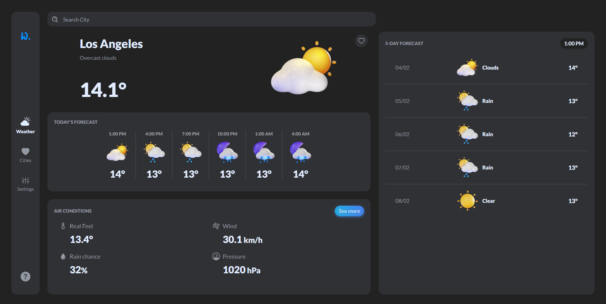
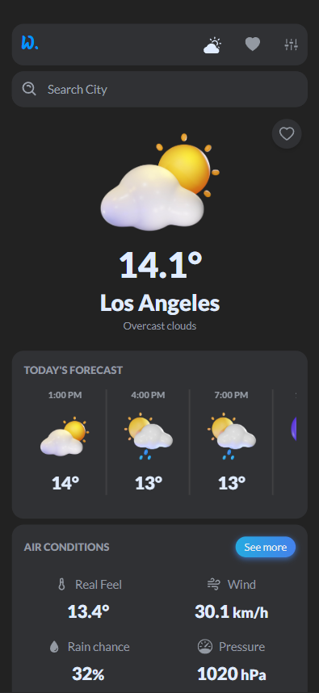
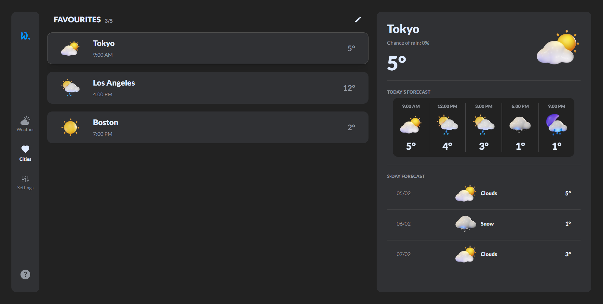
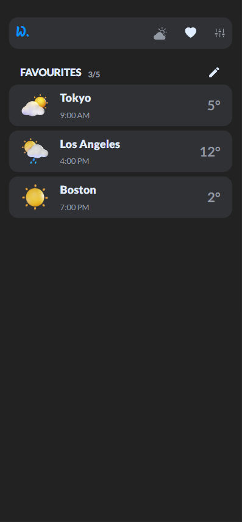
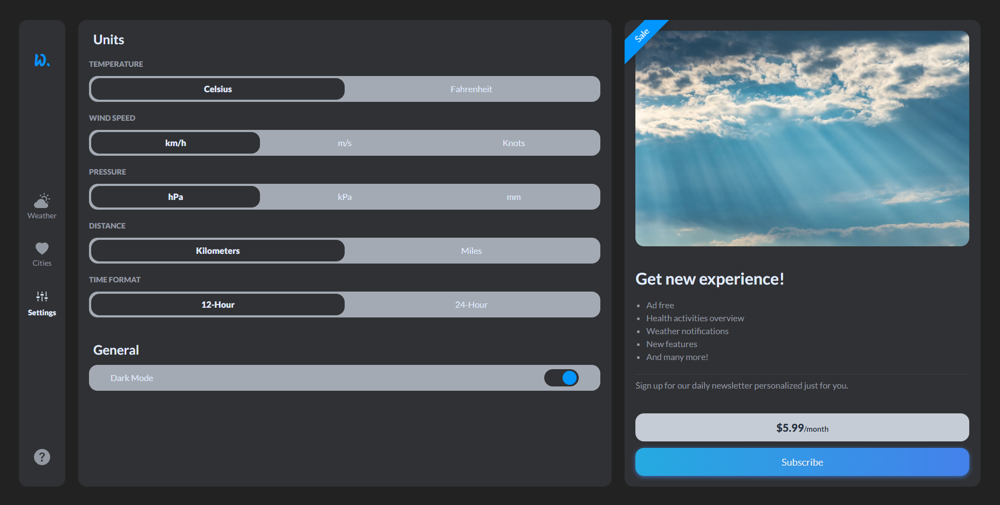
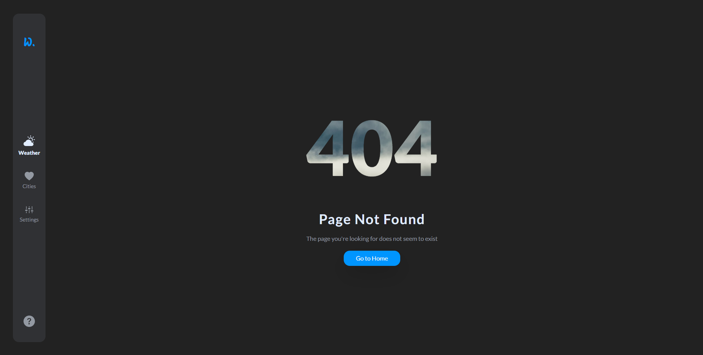
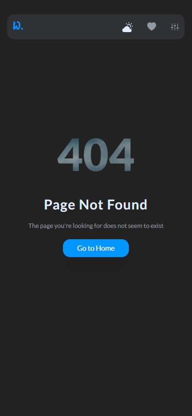
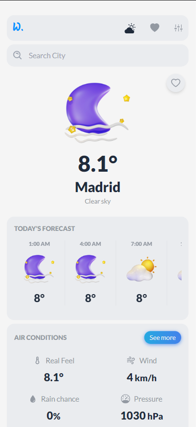

<div align="center">

# WeatherApp Project

[Live Page][live-page] . [Fallback Page][fallback-page]

</div>

<details>
<summary>Table of contents</summary>

-   [Overview](#overview)
    -   [Description](#the-challenge)
    -   [Landing Page](#landing-page)
    -   [Favourites Page](#favourites-page)
    -   [Settings Page](#settings-page)
    -   [404 Page](#404-page)
    -   [Light Mode](#light-mode)
    -   [Links](#links)
-   [My process](#my-process)
    -   [Built with](#built-with)
    -   [Getting Started](#getting-started)
-   [Author](#author)

</details>

## Overview

### Description

WeatherApp was created in order to deliver basic weather information at any location on the globe. Additionally, website displays weather forecast for the next hours and several days.

### Landing Page

The home page displays all weather information and forecasts for the coming hours and days.

At the top of the page there is a search bar through which users can select a city. Also they can click the heart icon and add selected city to their favourites.

<table>
    <tr>
        <td>
            
        </td>
        <td>
            
        </td>
    </tr>
</table>

### Favourites Page

The Favorites Page displays all the cities that the user has added to favorites. At any time, the user can freely change the order in which cities are displayed or remove them from the list.

The most important weather information for the selected city is displayed on the right.

<table>
    <tr>
        <td>
            
        </td>
        <td>
            
        </td>
    </tr>
</table>

### Settings Page

On the Settings Page, the user can select the units in which the weather data is to be presented and the appearance of the page.

On the right side, there is a space for an additional paid offer extending the functionalities of the application.

<table>
    <tr>
        <td>
            
        </td>
        <td>
            
        </td>
    </tr>
</table>

### 404 Page

If users misspell the city name or enter incorrect data, they will be redirected to the 404 Page.

<table>
    <tr>
        <td>
            
        </td>
        <td>
            
        </td>
    </tr>
</table>

### Light Mode

This is what the Light Mode version looks like.

<table>
    <tr>
        <td>
            
        </td>
        <td>
            
        </td>
    </tr>
</table>

### Links

-   [Live Page][live-page]
-   [Fallback Page][fallback-page]

## My Process

### Built with

-   Next.js
-   TailwindCSS
-   Framer Motion

### Getting Started

First, run the development server:

```bash
npm run dev
# or
yarn dev
# or
pnpm dev
```

Open [http://localhost:3000](http://localhost:3000) with your browser to see the result.

You can start editing the page by modifying `app/page.js`. The page auto-updates as you edit the file.

This project uses [`next/font`](https://nextjs.org/docs/basic-features/font-optimization) to automatically optimize and load Inter, a custom Google Font.

## Author

-   Jczyszczon - [link](https://jczyszczon.pl)

<p align="right">(<a href="#top">back to top</a>)</p>

[live-page]: https://weather.jczyszczon.pl
[fallback-page]: https://weather-app-gray-xi.vercel.app